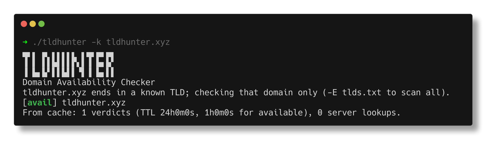

# tldhunter (domain availability checker)

A WIP Go rewrite and extension of [TLDHunt](https://github.com/yuyudhn/TLDHunt). A CLI to check domain name availability.



# How It Works?

Everything lives in a single file, [tldhunter.go](tldhunter.go), and uses only
the standard library -- no `whois(1)`, no `curl(1)`.

* **Keyword times TLD list.** The keyword is combined with every TLD in
  `tlds.txt`, which is embedded into the binary at build time. A keyword that
  already ends in a known TLD (`delta.sh`) is read as a single domain instead of
  a scan; `-e` checks one TLD, `-E` reads a list from a file.
* **Registry lookup, per TLD.** Each TLD is resolved to its registry endpoint by
  asking `whois.iana.org` on TCP/43 (RFC 3912). If IANA publishes no server, the
  conventional `whois.nic.<tld>` host is tried when it resolves.
* **RDAP fallback.** A growing number of registries (`.dev` and the rest of
  Google's are the standard example) answer only over RDAP. Those TLDs are
  looked up over HTTPS (RFC 7480/9082) using endpoints from IANA's bootstrap
  registry (RFC 9224). Handoff also happens mid-run, when a published whois host
  turns out to disown the TLD or has closed port 43.
* **Available first, then registered.** A whois response is matched line by line
  against explicit "no match"/"not found"/"status: free" patterns first, and only
  then against registration evidence (name servers, creation date, registrar,
  expiry). The shell original did the reverse, so any response it did not
  understand read as an available domain -- a registered `.de`, whose whois says
  only `Domain: x.de / Status: connect`, was reported free. Anything matching
  neither set is printed as `unknown` rather than guessed at. Over RDAP there is
  nothing to match: a 404 is the answer.
* **Grouped concurrency.** Domains are grouped by endpoint and each group is
  capped at `-perhost` concurrent queries (`-j` bounds the total). This matters
  because hundreds of gTLDs share one host -- a single Identity Digital RDAP
  endpoint serves 451 TLDs in the list -- so a flat worker pool would aim most of
  its concurrency at one machine and get throttled. Refusals and resets are
  retried with jittered exponential backoff, honouring `Retry-After`.
* **On-disk cache.** Verdicts, TLD-to-endpoint mappings, and the RDAP bootstrap
  registry are cached under `$XDG_CACHE_HOME/tldhunter` as one small JSON file
  per entry, written atomically. Only definitive answers are stored, never a
  network failure. Taken domains keep for 24h (`-ttl`), available ones for 1h
  (`-ttl-avail`), since those are the ones that go stale in the direction that
  costs something. `-ttl 0` disables the cache, `--clear-cache` removes it.

If you have a better signature or detection method, please feel free to submit a pull request.

# Domain Extension List

For the default Top Level Domain list (`tlds.txt`), we use data from
https://data.iana.org. You can update this list directly using the
`--update-tld` flag, which fetches the latest TLDs from IANA and saves them to
`tlds.txt`.

You can also use a custom TLD list, but ensure it is formatted like this:
```
.aero
.asia
.biz
.cat
.com
.coop
.info
.int
.jobs
.mobi
```

